# UI Testing Project with Playwright, Cucumber, and MongoDB

A simple UI automation project.

## Repository Description

This repository demonstrates a complete, minimal UI test automation workflow using Playwright directly and through Cucumber BDD, now backed by MongoDB.
It includes a demo UI (`demo-app/`), a Node API server (`server.js`), a Playwright test suite (`tests/`), and a Cucumber suite (`features/`) that validate core user behavior and persistence:

- page render and heading visibility,
- guest greeting when input is empty,
- personalized greeting when a name is provided,
- API-backed greeting persistence verified against MongoDB (TC-004, TC-005).

The project is intended for learning, demo, and starter-template use cases where teams need a fast way to understand Playwright setup, Cucumber workflow, MongoDB-backed flows, and reporting.

This project demonstrates:

- Playwright end-to-end UI testing
- Cucumber BDD scenarios with Playwright underneath
- MongoDB-backed API flow for realistic end-to-end validation
- Auto-starting a local app server before tests
- HTML reporting with Playwright

---

## Quick Start

Run from repository root:

```bash
cd ui-playwright-tests
npm install
npx playwright install chromium
Copy-Item .env.example .env
npm run db:up
npm run test:ui
```

Run the Cucumber suite:

```bash
npm run test:bdd:regression
```

Run the Playwright suite that verifies MongoDB persistence:

```bash
npm run test:ui:db
```

After execution, open the HTML report:

```bash
npm run report
```

---

## 1) Project Structure

- `demo-app/` → Static UI used for test automation
- `server.js` → Node + Express app server with API endpoints
- `db/seed.js` → MongoDB seed script for database initialization
- `docker-compose.yml` → MongoDB local container setup
- `tests/` → Playwright test specs
- `features/` → Cucumber BDD feature files, hooks, and step definitions
- `playwright.config.js` → Playwright runner configuration
- `package.json` → Scripts and dependencies

---

## 2) What Is Used

- Node.js 20+
- `@playwright/test`
- `@cucumber/cucumber`
- `express` for backend APIs
- `mongodb` for MongoDB connectivity
- Docker (for local MongoDB)

---

## 3) Prerequisites

1. Node.js 20 or newer
2. npm
3. Docker Desktop (for MongoDB container)

Verify:

```bash
node -v
npm -v
```

---

## 4) Install Dependencies

```bash
npm install
```

Install browser binaries used by Playwright:

```bash
npx playwright install chromium
```

Create local environment settings:

```bash
Copy-Item .env.example .env
```

Start MongoDB container:

```bash
npm run db:up
```

---

## 5) Run Tests

### Playwright test runner

Headless run (UI tests only):

```bash
npm run test:ui
```

Run MongoDB persistence tests (Playwright + DB assertions — TC-004, TC-005):

```bash
npm run test:ui:db
```

Run full Playwright suite (UI + DB specs, serial):

```bash
npm run test:ui:all
```

Headed run:

```bash
npm run test:ui:headed
```

Debug mode:

```bash
npm run test:ui:debug
```

### Cucumber BDD suite

Run all Cucumber scenarios:

```bash
npm run test:bdd
```

Note: this includes the intentional demo-failure scenario tagged `@negative`.

Run smoke scenarios only:

```bash
npm run test:bdd:smoke
```

Run regression scenarios excluding `@negative`:

```bash
npm run test:bdd:regression
```

Run only DB-backed Cucumber scenarios (TC-004, TC-005):

```bash
npm run test:bdd -- --tags "@db"
```

Run regression without DB scenarios:

```bash
npm run test:bdd -- --tags "@regression and not @negative and not @db"
```

---

## 6) Reports and Artifacts

Playwright creates:

- `playwright-report/` → HTML report
- `test-results/` → traces/screenshots/videos for failed tests

Cucumber in this repo uses console output formats defined in `cucumber.js` (`progress` and `summary`).

MongoDB data generated by tests is stored in the `greetings` collection in database `ui_playwright_tests`.

Open report:

```bash
npm run report
```

---

## 7) Included Example Test Cases

### UI tests (`tests/ui.spec.js`)

1. **TC-001** — Verify page heading is visible
2. **TC-002** — Verify empty input returns `Hello, Guest!`
3. **TC-003** — Verify typed input returns personalized greeting

### DB-backed Playwright tests (`tests/ui.db.spec.js`)

4. **TC-004** — Verify personalized greeting is saved to MongoDB with correct `name_input`, `resolved_name`, and `greeting_text`
5. **TC-005** — Verify guest greeting is saved to MongoDB with `resolved_name = Guest`

### Cucumber scenarios (`features/greeting.feature`)

| Tag | Scenario | Covers |
|---|---|---|
| `@smoke @regression` | TC-001 Home page loads with heading | FR-1 |
| `@smoke @regression` | TC-002 Guest greeting when input is empty | FR-3, FR-4, FR-6, FR-7 |
| `@regression` | TC-003 Personalized greeting when input has name | FR-2, FR-3, FR-5, FR-6, FR-7 |
| `@regression @db` | TC-004 Personalized greeting is saved to the database | FR-7, FR-8, FR-9 |
| `@regression @db` | TC-005 Guest greeting is saved to the database | FR-7, FR-8, FR-9 |
| `@negative` | TC-N01 Intentional failure for demo | — |

---

## 8) Troubleshooting

### Browser not installed error

```bash
npx playwright install chromium
```

### Port `4173` already in use

Stop the process using that port, then run tests again.

### MongoDB connection error

Make sure MongoDB is running and healthy:

```bash
npm run db:up
npm run db:logs
```

Verify `.env` values match your MongoDB config.

### `npm` command not found

Install Node.js and restart terminal.

### Cannot run `npm` on Windows PowerShell

On Windows, PowerShell may block `.ps1` wrapper scripts due to execution policy.

**Option 1: Use `.cmd` wrappers directly**
```powershell
npm.cmd install
npx.cmd playwright install chromium
npm.cmd run test:ui
```

**Option 2: Allow local scripts for current user**
```powershell
Set-ExecutionPolicy -Scope CurrentUser RemoteSigned
```

Then use `npm` and `npx` normally.

---

## 9) Next Improvements

- Add cross-browser projects (Firefox/WebKit)
- Add GitHub Actions workflow for UI test execution
- Add visual regression snapshots
- Add API contract tests for `/api/greet`

---

## 10) Requirements and Test Case Documentation

- App requirements: `docs/app-requirements.md`
- UI test cases: `docs/ui-test-cases.md`

---

## 11) How the App Was Tested

Testing was executed in two modes:

1. Direct Playwright execution using the Chromium project configured in `playwright.config.js`.
2. Cucumber BDD execution using Gherkin feature files and Playwright browser automation underneath.

### Test approach

- A Node server (`server.js`) hosts the UI and exposes `/api/greet` for greeting generation.
- The API writes greeting data to MongoDB collection `greetings`.
- Direct Playwright tests are implemented in `tests/ui.spec.js` and run against `http://127.0.0.1:4173`.
- DB-focused Playwright tests in `tests/ui.db.spec.js` validate both UI output and persisted MongoDB documents.
- Cucumber scenarios are implemented in `features/greeting.feature` and mapped to Playwright-backed step definitions.
- Assertions cover page render and greeting behavior for both empty and non-empty input.

### Commands used

```bash
npm install
npx playwright install chromium
Copy-Item .env.example .env
npm run db:up
npm run test:ui
npm run test:ui:db
npm run test:bdd
```

### Executed checks

1. Home page heading is visible (TC-001).
2. Empty name input returns `Hello, Guest!` (TC-002).
3. Entered name returns personalized greeting, e.g. `Hello, Rahul!` (TC-003).
4. Personalized greeting is saved to MongoDB with correct field values (TC-004).
5. Guest greeting is saved to MongoDB with `resolved_name = Guest` (TC-005).

### Evidence and artifacts

- Playwright console list reporter output during execution.
- Playwright HTML report generated in `playwright-report/`.
- Retry artifacts (trace, screenshot, video on failure) in `test-results/`.
- Cucumber console progress and summary output for BDD execution.
- MongoDB document-level verification in `tests/ui.db.spec.js`.

---

## 12) BDD with Cucumber

This repository also supports BDD-style tests using Cucumber + Playwright.

### Playwright content in this repo

The repository contains both pure Playwright content and Cucumber scenarios that use Playwright underneath.

| Area | Main files | Purpose |
|---|---|---|
| Pure Playwright | `playwright.config.js`, `tests/ui.spec.js`, `package.json` scripts like `test:ui` | Run UI tests directly with the Playwright test runner |
| Playwright + MongoDB assertions | `tests/ui.db.spec.js`, `tests/db-client.js` | Validate UI behavior and MongoDB persistence in the same flow |
| Cucumber + Playwright | `cucumber.js`, `features/greeting.feature`, `features/step_definitions/greeting.steps.js`, `features/support/hooks.js`, `features/support/world.js` | Write scenarios in Gherkin and execute them through Playwright browser automation |

In other words, Playwright is used in two ways here:

1. As the main test runner for `tests/ui.spec.js`.
2. As the browser automation engine under the Cucumber BDD layer.

### Cucumber workflow in this repo

The practical workflow is:

1. A tester or BA writes business-readable scenarios in Gherkin in `features/greeting.feature`.
2. Cucumber reads `cucumber.js` to discover support files and step definitions.
3. Hooks in `features/support/hooks.js` prepare the browser and app server.
4. Cucumber matches each `Given`/`When`/`Then` step to a JavaScript function in `features/step_definitions/greeting.steps.js`.
5. Those step-definition functions use Playwright to interact with the UI and make assertions.
6. Hooks clean up the browser context after each scenario and close shared resources after the suite.

In short:

`Gherkin scenario` -> `Cucumber step match` -> `step definition` -> `Playwright action/assertion`

```mermaid
flowchart LR
	A[Tester writes Gherkin\nfeatures/greeting.feature] --> B[Cucumber reads cucumber.js]
	B --> C[Load hooks, world,\nand step definitions]
	C --> D[BeforeAll starts server\nand browser]
	D --> E[Before creates fresh\ncontext and page]
	E --> F[Match Given/When/Then\nto greeting.steps.js]
	F --> G[Playwright interacts\nwith the UI]
	G --> H[Assertions validate\nexpected result]
	H --> I[After closes context]
	I --> J[AfterAll closes browser\nand server]
```



### How Cucumber is used in this repo

1. Business scenarios are written in Gherkin in `features/greeting.feature`.
2. Each Gherkin step is implemented in JavaScript step definitions in `features/step_definitions/greeting.steps.js`.
3. Cucumber hooks in `features/support/hooks.js` manage lifecycle:
	- ensure the demo app server is available on port `4173`,
	- launch Playwright Chromium before the suite,
	- create a fresh browser context/page per scenario,
	- close context and browser after execution.
4. Shared scenario state (`page`, `context`, `browser`) is stored in `features/support/world.js`.
5. Cucumber runtime wiring is defined in `cucumber.js`.

### Scenario traceability

| Scenario ID | Feature file scenario | Requirement(s) | Tag(s) |
|---|---|---|---|
| TC-001 | Home page loads with heading | FR-1 | `@smoke @regression` |
| TC-002 | Guest greeting when input is empty | FR-3, FR-4, FR-6, FR-7 | `@smoke @regression` |
| TC-003 | Personalized greeting when input has name | FR-2, FR-3, FR-5, FR-6, FR-7 | `@regression` |
| TC-004 | Personalized greeting is saved to the database | FR-7, FR-8, FR-9 | `@regression @db` |
| TC-005 | Guest greeting is saved to the database | FR-7, FR-8, FR-9 | `@regression @db` |
| TC-N01 | Intentional failure for demo | — | `@negative` |

Scenario IDs match the documented test cases in `docs/ui-test-cases.md`.

### Execution flow

When you run `npm run test:bdd`, Cucumber executes this sequence:

1. Load support files and step definitions from `cucumber.js`.
2. Run `BeforeAll` hook to prepare server/browser.
3. For each scenario, run `Before` hook, scenario steps, then `After` hook.
4. Run `AfterAll` hook to close remaining resources.

### From Gherkin step to Playwright code

This is the exact lifecycle for one step in this repository:

1. Cucumber reads a step from `features/greeting.feature`, for example:

```gherkin
When I enter the name "Rahul"
```

2. Cucumber searches the loaded step-definition files for a matching expression.
3. It finds this implementation in `features/step_definitions/greeting.steps.js`:

```js
When("I enter the name {string}", async function (name) {
	await this.page.locator("#name-input").fill(name);
});
```

4. The value `Rahul` is passed into the `name` argument.
5. `this.page` comes from the Cucumber World created in `features/support/world.js` and initialized in the `Before` hook in `features/support/hooks.js`.
6. Playwright fills the input field in the browser.
7. A later `Then` step reads UI output and validates the result with an assertion.

That means Gherkin is the readable specification, but the JavaScript step definition is what makes the scenario executable.

---

## 13) MongoDB Enhancement Summary 

This section explains what was added and why.

### What changed

1. Added `server.js` to serve the UI and provide API endpoints.
2. Added MongoDB collection/index setup in `db/seed.js`.
3. Added Docker setup in `docker-compose.yml` for local MongoDB.
4. Updated `demo-app/script.js` to call `/api/greet` instead of generating greeting only in the browser.
5. Added Playwright DB tests in `tests/ui.db.spec.js` that verify both UI text and actual MongoDB documents (TC-004, TC-005).
6. Updated Playwright and Cucumber server startup to use `node server.js`.
7. Added new functional requirements: FR-7 (API endpoint), FR-8 (persistence), FR-9 (record structure) — documented in `docs/app-requirements.md`.
8. Added TC-004 and TC-005 to `docs/ui-test-cases.md` with full step-by-step coverage.
9. Added TC-004 (`@regression @db`) and TC-005 (`@regression @db`) Cucumber scenarios to `features/greeting.feature`.
10. Added new Cucumber step definitions: `Given the greetings table is empty`, `Then the latest greeting in the database should have name {string}`, `Then the latest greeting in the database should be for a guest`.
11. Renamed the previous `TC-004 Intentional failure` scenario to `TC-N01` (tagged `@negative`) to free the TC-004 slot for the new DB test.

### Why this is useful

Before this enhancement, tests proved only UI behavior in memory.
Now tests prove full end-to-end behavior:

1. UI action happens.
2. API receives the request.
3. MongoDB stores the data.
4. UI shows the expected result.

### End-to-end request flow

1. User clicks `Generate greeting` in the browser.
2. Frontend sends `POST /api/greet` with input name.
3. Server computes greeting and inserts a document in MongoDB.
4. Server returns greeting JSON.
5. Frontend displays greeting text.
6. Playwright DB tests query MongoDB and verify document values.

### Commands you will use most

```bash
npm run db:up
npm run test:ui
npm run test:ui:db
npm run test:bdd
npm run report
```

Stop local DB when done:

```bash
npm run db:down
```

### What can be done with Cucumber?

A tester can contribute at multiple levels depending on technical depth:

1. Specification role: write and review Gherkin scenarios, examples, tags, and acceptance coverage.
2. Functional test design role: define happy paths, edge cases, negative cases, and traceability to requirements.
3. Execution and analysis role: run suites, filter by tags, inspect failures, and report defects.
4. Automation role: write or maintain step definitions, assertions, hooks, and Playwright interactions.

So a tester does not have to only use Gherkin. A non-technical tester may work mostly in feature files, but a technical tester or SDET often writes both Gherkin and the underlying automation code.

### Underlying code

Gherkin alone is not executable. Step definitions and automation code must be implemented.

1. Manual tester or BA writes Gherkin, and an automation tester/SDET writes the step definitions.
2. Tester and developer collaborate, with the developer implementing some or all step definitions.
3. A technical tester owns both the Gherkin and the automation layer.

In this repository, the underlying executable code is mainly:

- `features/step_definitions/greeting.steps.js` for step implementations
- `features/support/hooks.js` for setup and teardown
- `features/support/world.js` for shared scenario state


If you are new to Cucumber, the most useful order is:

1. Learn to write good Gherkin: keep steps clear, behavior-focused, and non-technical.
2. Learn how step definitions map Gherkin sentences to executable code.
3. Learn basic Playwright automation so you can understand and eventually maintain the underlying implementation.
4. Learn hooks, tags, and test data patterns so you can scale scenarios without duplication.

This progression helps you move from specification writing to full test automation without treating Cucumber as only a documentation tool.

### Run BDD suite

```bash
npm run test:bdd
```

Run smoke-only BDD scenarios:

```bash
npm run test:bdd:smoke
```

Run full regression-tagged BDD scenarios:

```bash
npm run test:bdd:regression
```

This regression command runs scenarios tagged `@regression` and excludes scenarios tagged `@negative`.

### BDD structure

- `features/greeting.feature` → business-readable scenarios
- `features/step_definitions/greeting.steps.js` → step implementations
- `features/support/hooks.js` → browser/server lifecycle hooks
- `features/support/world.js` → shared Cucumber world state

### Notes

- Cucumber hooks start the demo app server on port `4173` if it is not already running.
- Browser automation is performed with Playwright Chromium.
- Tags allow selective execution: `@smoke`, `@regression`, `@db`, `@negative`.
- The `@db` tag marks scenarios that require MongoDB — run `npm run db:up` before using them.
- TC-004 and TC-005 are tagged `@db` and use `clearGreetings()` and `getLatestGreeting()` from `tests/db-client.js` to verify MongoDB persistence.
- The intentional failing demo scenario is tagged `@negative` and renamed `TC-N01` to avoid conflicting with the DB test case `TC-004`.
